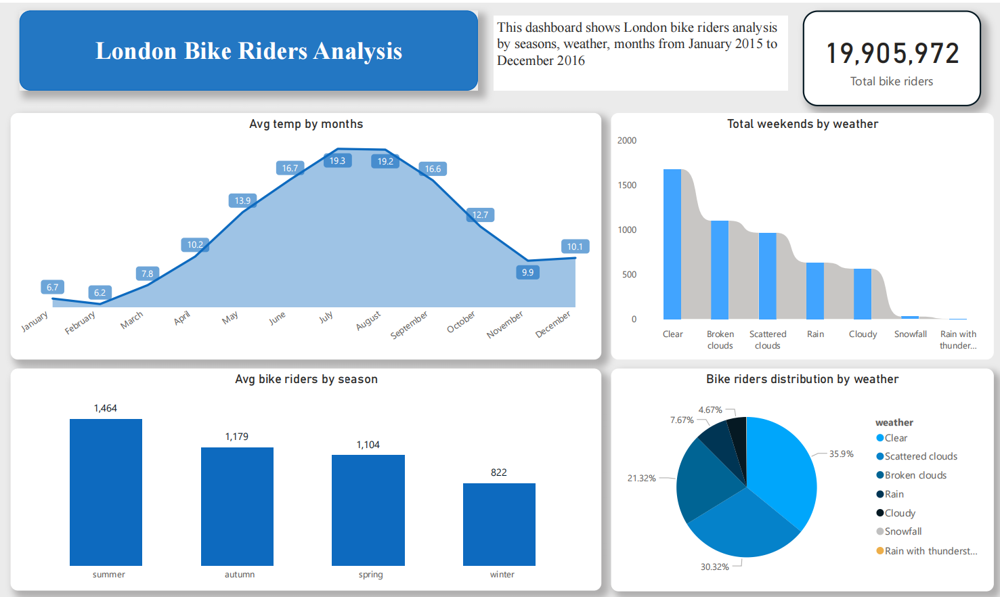

# London Bike Riders Data Analysis (2015–2016)

## Business Problem
Urban mobility planning requires understanding how demand is influenced by time, weather, and seasonality.
This project analyzes London bike rental data to identify usage patterns, peak demand periods, and
external factors affecting rider behavior.

## Dataset
- Source: Public London bike sharing dataset
- Time span: 2015–2016
- Granularity: Hourly / daily ride records
- Key fields: ride count, temperature, weather conditions, date, time, season

## Tools & Technologies
- Python (Pandas, NumPy)
- SQL
- Power BI

## Data Processing (ETL)
- Cleaned and merged weather and ride datasets
- Standardized date and time formats
- Engineered time-based and seasonal features
- Transformed data using Power Query for analysis-ready modeling

## Key Insights
- Bike demand peaked during weekdays and commuting hours
- Weather conditions significantly influenced ride volume
- Seasonal patterns showed higher demand in warmer months
- Weekend usage patterns differed from weekday commuting behavior

## Business Insights & Recommendations
- Demand forecasting should account for weather sensitivity
- Operational capacity can be optimized by time-of-day trends
- Weekend and weekday strategies should be planned separately
- Seasonal demand patterns support flexible resource allocation

## Dashboard Preview

### Usage Overview

## Outcome & Business Value
This analysis enables data-driven urban mobility planning, operational optimization,
and improved understanding of rider behavior under varying conditions.
